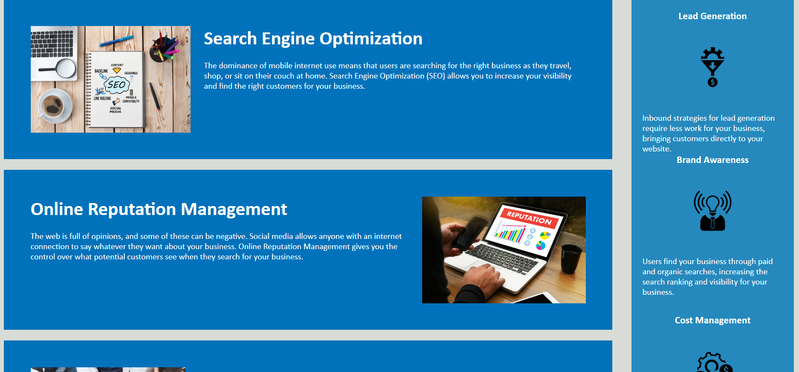

# SemanticHTMLConversion

## The Challenge of this Course
One of the main challenges that is highlighted in this exercise is the introduction to GitHub. This assessment is designed to prepare students for GitHub and deployment.

### Challenge Type

The Challenge was the following:

Receive a starter code and modify and save changes throughout. 

* I have learned about **On-the-job** or **feature request challenge**, I have been given a starter code and modified it to meet the standard expected of me.

 **Important**: For this assignment it was important for to students create a new repo and DID NOT include the `Develop` folder itself, only the contents of the `Develop` folder.

 * I have also learned about **Job-seeking coding assessments** or **take-home assignments** because unlike this assignment here those do not provide a starter code. I have not built this application from scratch

 ### Challenge Elements

 Concepts like **agile project management** are major in software development and commonly used. It is a way that team manage work and adhere to a format. Getting this practice under my belt is said to be great when it comes to preparing to be a professional in the industry as a Full-Stack Developer

 * **User Story**: This Challenge was an exercise not only where I wanted to get associated and comfortable with HTML Semantic elements but mainly to get used to pushing to GitHub and then Deploying it as well. This Challenge was necessary and I wanted to make sure that every big change I made was committed and eventually push so that deployment was up and running as intended.

 * **Acceptance Criteria**: The success of this challenge are depending on whether or not certain requirements are met. Having a working solution is a part of what is needed along with some other basic requirements. This assignment in particular used a common format called **scenario-oriented criteria** which is expressed in WHEN / THEN way about it. 

 * **Mock-up**: The following image/animation is what I used as a guideline to match the sites design and functionality.

* **Submission**: I have submitted this SemanticHTMLConversion application for review. In the process of becoming a real world developer, I realize that upon finishing my work, I must have other developers review and give feedback on my projects. This ensures that all of the criteria is met and for this phase of my journey the instructional staff and the grading teams will serve as my reviewing board to confirm my success or send me back to the drawing board. I have deployed successfully, submitted the proper links, and look forward to hearing back.

## My Task

The challenge was an example of an **On-the-job** ticket. I have built an application by using starter code

## User Story

```
AS A member of a marketing agency
I WANT to be certain that accessibility is something that is executed at a high standard
SO THAT our site is conveniently optimized for search engines and those who rely on technology that cater to those specific needs
```
## Acceptance Criteria

```
GIVEN a webpage with built in accessibility functions
WHEN I view the source code
THEN I see that there are many semantic HTML elements
WHEN I examine the structure of the HTML elements
THEN I discover that the elements that have been coded adhere to logical structure that doesn't necessarily lineup with styling and positioning
WHEN I view icons and images on this application
THEN I find up to standard alt attributes
WHEN I view the heading attributes
THEN they follow sequential order
WHEN I view the title element
THEN I find a descriptive title that is very much to the point
```


## Review

This section is here to meet review requirements for submission:

* The following link redirects you to my deployed application:

Refer to this [Deployed Application](https://thekhalidgibson.github.io/SemanticHTMLConversion/) to view the functionality of this webpage


* The following link redirects you to my GitHub repository for SemanticHTMLConversion:

Refer to this link [GitHub Repository](https://github.com/TheKhalidGibson/SemanticHTMLConversion) to view and explore the GitHub repo for this assignment


## Screenshots

The following images show the results of this application's development phase:





 


